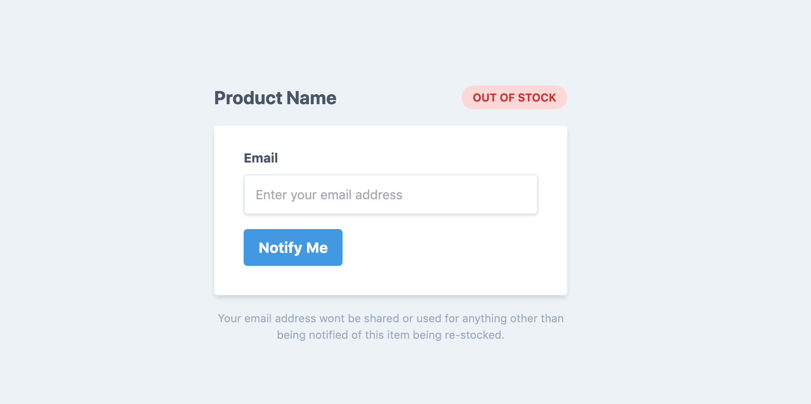

<p align="center"></p>

# Back In Stock plugin for Craft Commerce 2

This plugin allows anyone to register interest on out of stock products.
If they do and the product becomes re-stocked an email will automatically be sent to all interested emails with a link prompting them to buy now.

The plugin comes with a [basic, responsive email template](./src/templates/emails/notification.twig) but can be replaced with a custom template. The subject line of the email can also be customized via the plugins settings.

## Installation

Either by the plugin store (search "Back In Stock") or via composer.

`"mediabeastnz/craft-commerce-back-in-stock": "^1.0.0"`

## Requirements

This plugin requires Craft CMS 3.0.0 or later and Craft Commerce 2.0 or later.

## Frontend form setup

This plugin allows you to send a form submission to specific action which will create the necessary records.

You will need to implement the logic that displays this form if a product is out of stock but I have created a helper template to help get you started.

Use something like `hasStock` to check if the product/variant is out of stock.

The form will need 3 fields. 2 hidden fields and 1 visible field where the user can enter their email.

```twig
<input type="hidden" name="action" value="craft-commerce-back-in-stock/base/register-interest">
<input type="hidden" name="variantId" value="{{ product.defaultVariant.id }}">
<input type="text" name="email" value="{{ currentUser.email }}">
```

The `variantId` fields value might need to be dynamic if your site allows the user to change variants e.g. select. I recommend a simple script to ensure the selected variant is populated here.

If you only have one variant then use the example provided above.

You can also include an `options` value to save additional information with the form submission. This should be in the form of a JSON object. This input is entirely optional.

```twig


<input type="hidden" name="options" value="{{ options | json_encode }}">
```

You can use these variables in your email template, or subject line via `options.title` (as per the above example). Make sure you check to see if values exist when doing so!

Check out the [helper template](./resources/templates/form-example.twig) (built using Tailwind) if you need some to get you started.


